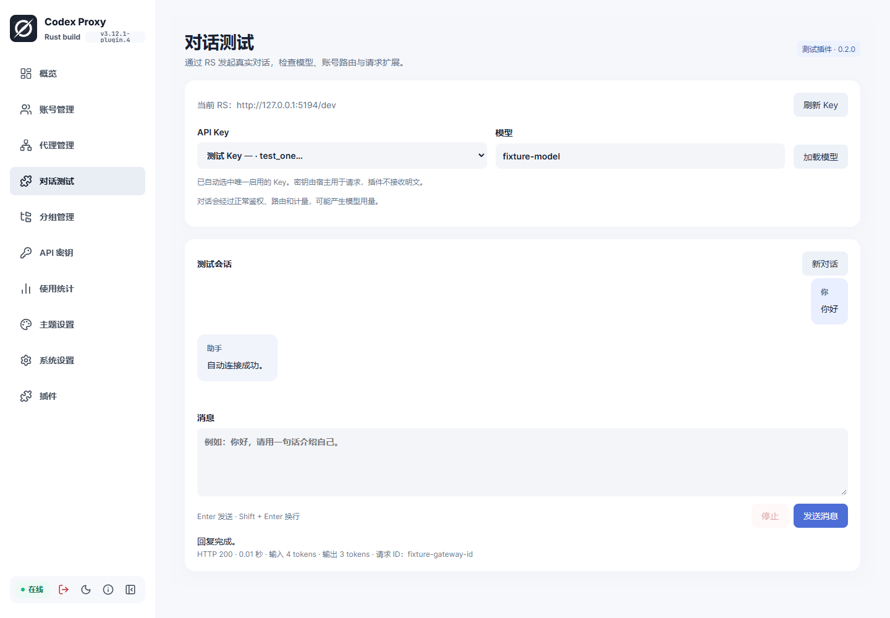
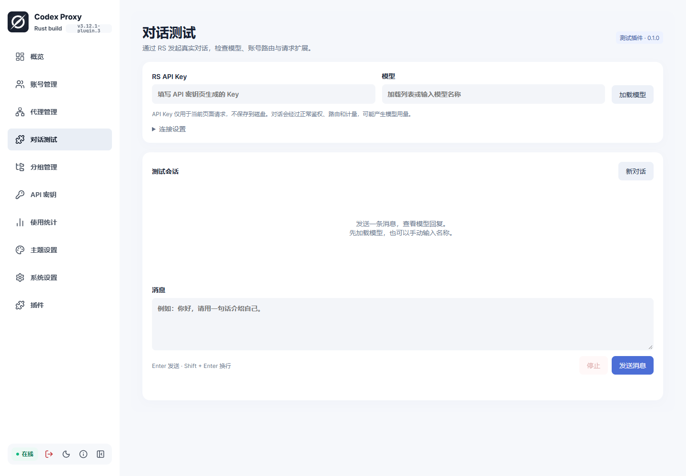
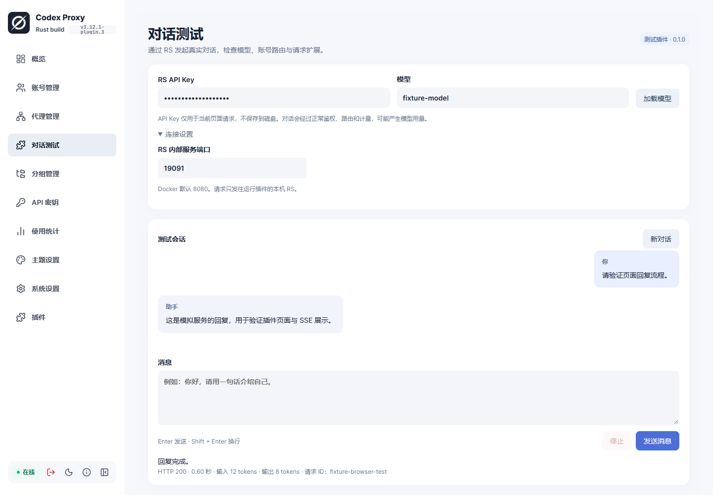
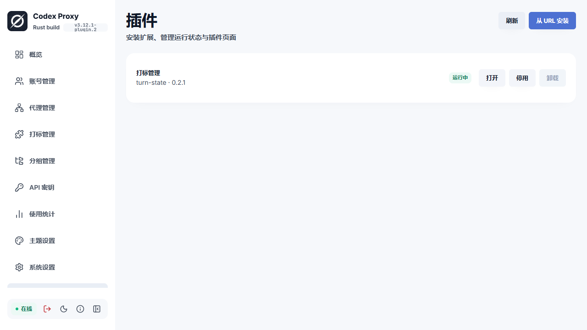
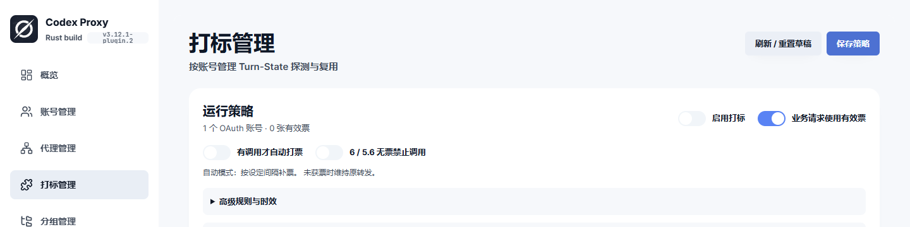
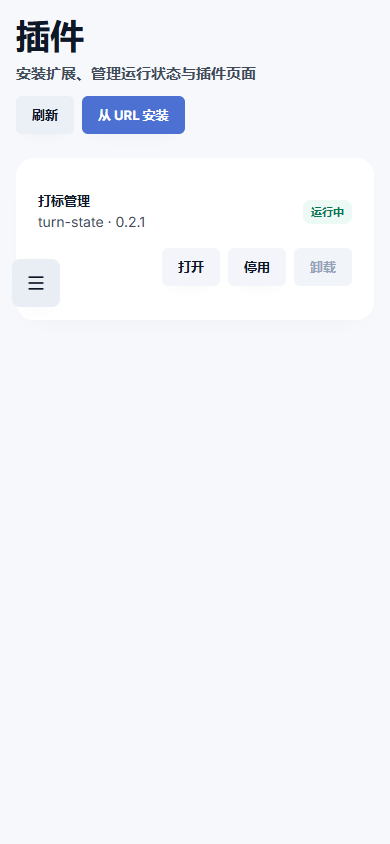
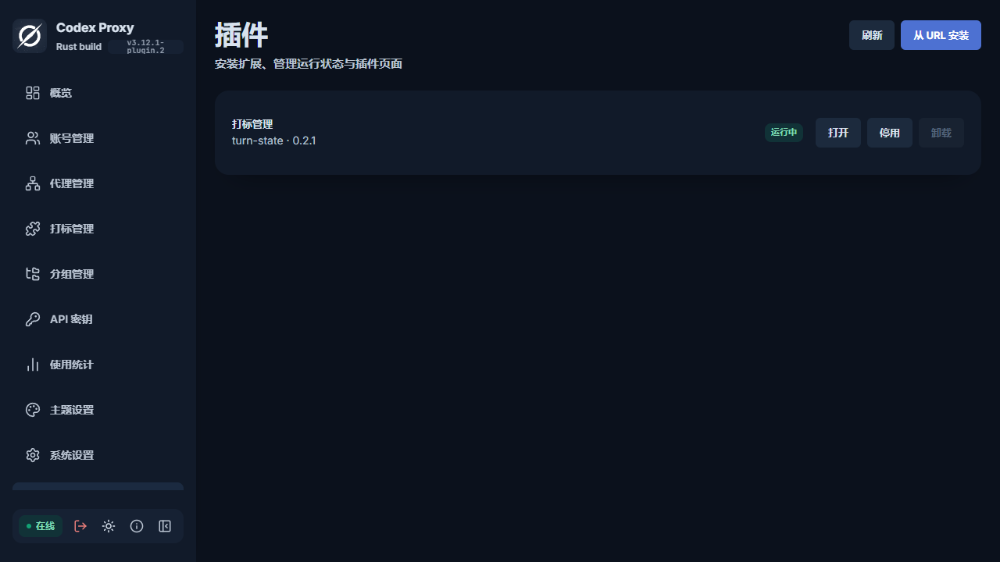

# v3.12.1-plugin.4 与对话插件 0.2.0 验证

- 宿主插件测试 19 项、管理 API 2 项及严格 Clippy 通过，保留仓库 result_large_err 既有例外。新增 ui.chat 能力清单接受/未知权限拒绝场景。
- 对话插件原生进程仅提供页面；握手、拒绝旧 admin.start 密钥 RPC、无磁盘持久化测试与严格 Clippy 通过。
- 前端 ESLint、vue-tsc、Vite 构建通过。
- 真实浏览器配合模拟 API：验证当前同源地址、唯一 Key 自动选中、多 Key 切换、停用 Key 排除、无 Key 提示、插件停用后拒绝请求、未声明 ui.chat 时拒绝，以及 iframe 消息和原生 RPC 都未收到模拟明文 Key。模型列表和 Responses SSE 回复经过宿主新桥成功显示。
- 部署实例实际验证：浏览器自动识别当前 18087 地址、自动选中现有唯一启用 Key、没有明文输入框；GET /v1/models 返回成功但模型列表为空。没有为此修改用户账号或 Key 路由范围。
- 新桥只向当前站点固定端点发送请求，禁止重定向，不接受插件提供的 URL、认证头或明文 Key。需使用管理员现有权限读取已选 Key，真实请求按所选 Key 正常计量。能力授权仍没有逐 Key 安装白名单。

下方保留此前版本的验证范围，不能把历史模拟回复当作当前实例真实上游调用成功。

# v3.12.1-plugin.3 补充验证（2026-09-20）

- 实际复现：同一容器直连 GitHub 曾成功，也出现连接超时；安装器失败耗时约 10 秒，符合连接预算。指定已配置的 SOCKS 代理后，真实 GitHub Release 包通过管理 API 下载安装成功。不能将偶发直连成功当作网络持续可达，也不能把此次网络问题写成打标业务代理缺失。
- 本次宿主插件测试 18 项、管理 API 测试 2 项通过；严格 Clippy（沿用 result_large_err 例外）、Rustfmt、组合根/API 架构 17 项通过。新增测试确认选定代理参与连接、SHA256 错误和连接错误分类。
- 前端受影响文件 ESLint、vue-tsc 和 Vite 构建通过。
- 对话插件真实进程 workflow.py 通过：模型列表、中文 UTF-8 跨字节分片 SSE、多轮正文、用量、HTTP 错误中密钥脱敏、取消与无磁盘持久化；插件严格 Clippy 通过。
- 实际验证实例：临时有效 Client Key 的模型列表返回 200 / 空列表；发送请求进入正常鉴权和路由后返回 503 `no provider can execute this request`。实例当前没有账号，故未完成真实模型回复验收。临时 Key 已删除，没有修改用户现有 Key/代理/账号。
- 浏览器真实界面验收通过：下载代理选择与 GitHub 安装、必填 Key 提示、真实 401、本机模拟模型/SSE 回复、多轮、停止、清空与手机布局。截图见下方（回复明确为模拟）。页面曾使用原生表单触发发送，被 iframe 隔离策略阻止；已改为按钮消息桥调用，未放宽 sandbox。
- 对话页面的回复展示使用独立本机模拟服务，与真实生产回复分开记录。打标插件安装代理链验证完成后已卸载，保留由用户重新安装；对话插件保留启用。
- 下载代理来自宿主保存的配置，由宿主解析认证；CONNECT / SOCKS 代理参与最终域名解析，仍需信任代理。对话插件 API Key 与消息只存在内存，宿主正常计量和诊断日志仍适用。

下方为 plugin.2 的历史验证记录，不代表本次重跑所有旧业务测试。

# v3.12.1-plugin.2 验证与上游参考

日期：2026-09-20。对象为本 fork `codex/plugin-host` 分支的 `3.12.1-plugin.2` 变更；独立打标插件为 `0.2.1`。此记录区分本次运行证据、此前证据和未验证项，不宣称生产就绪。

## 本次实际通过

| 检查 | 命令 / 环境 | 结果与边界 |
| --- | --- | --- |
| 宿主插件 | `cargo test --offline --locked --manifest-path backend/Cargo.toml -p gateway-host --test main plugins -- --test-threads=1` | 17 项通过；Linux x86_64，真实子进程、局域网 HTTP 测试包服务 |
| 管理接口 | 同命令改为 `-p gateway-api` | 2 项通过，管理员鉴权、no-store、合法管理动作、未知动作和字段拒绝 |
| 静态检查 | `cargo clippy --offline --locked --manifest-path backend/Cargo.toml -p gateway-host -p gateway-api --all-targets -- -D warnings -A clippy::result_large_err` | 通过；result_large_err 为仓库既有例外，不表示零 lint 例外 |
| 架构 | `cargo test --offline --locked --manifest-path backend/Cargo.toml -p codex-proxy-rs -p gateway-api --test main architecture -- --test-threads=1` | 组合根 12 项、API 5 项通过 |
| Rust 格式 | `cargo fmt --all --manifest-path backend/Cargo.toml` | 已应用，变更文件经过格式化 |
| 前端 | 在 frontend 下运行 `node node_modules/eslint/bin/eslint.js .`、`node node_modules/vue-tsc/bin/vue-tsc.js -b --pretty false`、`node node_modules/vite/bin/vite.js build` | ESLint、类型检查与构建通过；最后手机布局修改后重跑相应文件 ESLint、类型和构建 |
| 打标独立进程 | 独立插件仓库 `python3 tests/workflow.py dist/turn-state-0.2.1/worker` | 保存、手动探测、身份门禁、代理导入、出口采样、日志、持续并发、按需自动、重启恢复通过；Provider 为模拟服务，不访问真实上游 |
| 部署 | 独立 Docker 验证实例、克隆数据库、保留历史迁移原字节的兼容构建 | healthz 204；版本 3.12.1-plugin.2；turn-state 0.2.1 可用；原生产实例未切换 |
| 浏览器 | Playwright CLI，实际部署的 HTTP 页面，1440×1000、390×844 | 从侧栏直接打开打标、停用隐藏菜单、容器重启后仍停用、重新启用恢复入口；URL 安装示例包默认停用，启用后打开页面，停用卸载，错误 SHA256 提示均通过 |

新增管理测试覆盖：旧配置数据目录与 URL 新包重叠拒绝、重复安装拒绝、安装失败临时目录清理、符号链接包拒绝、错误整包摘要、不支持协议和回环/链路本地地址拒绝、写注册表失败不改变运行状态、启停跨重启、卸载保留数据、相同 ID 再安装恢复数据、停用扩展跳过而启用故障不静默放行。

页面截图仅保留无账号凭据区域：

## 已处理的验收问题

- API 无效 JSON 的实际合同是 422，测试最初期待 400，已按现有 AdminJson 行为修正；未修改 API 以迎合测试。
- 旧临时集成测试文件留在 NAS 构建树、未声明模块，导致架构检查失败；将临时文件移出生产测试树后 17 项通过，仓库未放宽规则。
- Windows 沙箱禁止 Vite 依赖启动子进程；在批准的宿主构建环境完成构建。
- 浏览器发现手机插件名称被操作按钮挤窄，调整名称最小宽度和操作行布局后重新构建并验收。
- 第一次部署产物因共享构建缓存混用了官方 16 条迁移，验证实例拒绝启动。先恢复旧镜像，再清理 gateway-store 的编译缓存，用历史 18 条迁移的只读挂载重新构建，将结果立即复制到独立部署产物后再打镜像。最终启动正常；未修改数据库、迁移内容或 checksum。这个兼容构建仅服务历史 fork 验证实例，不能充当官方数据库迁移方案。

## 继承的此前证据

plugin.1 阶段已跑过 Provider 的 HTTP/WS 状态替换、凭据过滤、身份摘要失效及真实完整打标插件的宿主握手/注入集成测试；本次没有重新执行所有 Provider 集成测试。当前变更未修改 Provider wire 逻辑，这些历史结果不等同于本版本生产上游实测。

## 尚未验证 / 尚未实现

- 未向真实 OpenAI 账号执行完整生产推理或自动打票验收；验证实例自动打标仍关闭。
- 未做高并发、长期稳定性、16 个插件同时运行、数据面/管理面争用的性能基准。
- 未穷尽 HTTP 重定向、DNS 重绑定、压缩炸弹和中途断连的网络故障矩阵；这些代码路径有防护但不等于已有全部测试覆盖。
- 未完成恶意原生插件隔离、子孙进程清理、CPU/内存限额、发布者签名、细粒度能力授权。
- 未完成数据库级管理员审计；当前仅记录管理成功的插件 ID 和动作。
- 未验证 Windows/macOS/ARM 原生插件、私有 GitHub 登录下载、自动更新及跨版本数据迁移。
- 插件 iframe 不自动继承宿主深色主题；本次深色截图验收的是宿主管理页。
- 未执行全仓 PostgreSQL/Redis 集成套件、完整 Cargo/pnpm 安全审计或正式生产回滚演练。
- registry.json 在普通文件失败时有原子替换，但没有断电事务日志、跨进程锁和自动垃圾回收。
- 当前验证镜像包含构建工具，使用开发 profile 的剥离二进制，不作为面向外部用户的生产发行镜像。

## 上游讨论建议

可独立评估三个边界：外部进程协议和失效行为、Provider 受限服务端口、固定路由与隔离页面。动态安装和原生代码信任策略可作为独立决策，不必为了某一业务插件一次接受全部框架。

合入前建议先确定 API 兼容策略、发行签名与平台元数据、权限粒度、管理员审计 owner、更新/回滚合同，以及请求扩展对时延与故障域的影响。此分支提供可运行实现与已知限制，不把原型实现作为已经冻结的上游设计。
