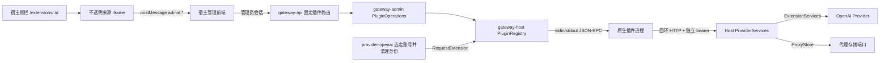

# Fork 外部进程插件系统

## 版本与定位

宿主版本 **3.12.1-plugin.3**，基于上游 **v3.12.1 / 01006380**。代码位于 kumu-ze/codex-proxy-rs 的 codex/plugin-host 分支；本方案用于提供上游设计参考，不代表上游已经接受插件 API。API 主版本目前为 1，仍可能在后续实验版发生不兼容变化。构建默认读取 release/version.yaml，不要把 CPR_VERSION 改成无后缀的官方版本。

独立示例为 examples/plugins/echo，另有 [对话测试插件](../examples/plugins/chat/README.md)；完整 Turn-State 插件位于独立的公开仓库 [kumu-ze/rs-turn-state-plugin](https://github.com/kumu-ze/rs-turn-state-plugin)，可从其 Release 获取插件包；上游评审可分别运行 echo、宿主测试和独立业务工作流。宿主不引用该业务 crate，也不内置其策略、调度、页面或数据模型。

## 架构与调用关系



| 所属模块 | 职责 / 代码入口 |
| --- | --- |
| apps/gateway/src/bootstrap.rs | 唯一组合根，读取配置、启动注册表、挂接 Provider 和 ProxyStore、退出时关闭插件 |
| gateway-admin/src/ports/plugins.rs | 列表、调用、管理操作与错误合同，不处理进程和文件 |
| gateway-api/src/admin/plugins.rs | 固定 HTTP 路由、管理员鉴权、wire 映射，不允许插件注册宿主路由 |
| gateway-host/src/plugins/manifest.rs、install.rs、management.rs | manifest、摘要、路径校验、下载解包、原子保存注册表 |
| gateway-host/src/plugins/registry.rs、process.rs | 安装与启停协调、调用预算、子进程握手和通信失效处理 |
| gateway-host/src/plugins/services.rs | 每插件独立回调入口及代理能力适配 |
| gateway-core/src/engine/extensions.rs | Provider 无关的请求扩展及服务端口 |
| providers/openai/src/extension_services.rs | 账号快照、固定探测、同源出口采样；Provider 保留 OAuth 所有权 |
| frontend/src/views/plugins、stores/modules/plugins.ts | 管理操作、独立页面路由、动态菜单和 iframe 消息校验 |

## 包格式与开发流程

只安装与宿主操作系统、CPU 和运行库匹配的**可信原生程序**。目前验证环境是 Linux x86_64，未提供跨平台包选择器。示例清单：

```json
{
  "id": "example",
  "version": "1.0.0",
  "apiVersion": 1,
  "executable": "worker",
  "menuLabel": "示例插件",
  "capabilities": ["request.openai", "provider.openai"],
  "files": { "worker": "<文件内容的 SHA256 小写十六进制>" }
}
```

id 为 1–64 个小写字母、数字或连字符；version 使用 SemVer。menuLabel 可省略，非空时最多 24 个字符且不能包含控制字符；宿主将它作为纯文本渲染。可选能力当前仅接受上例两种。清单最多 64 KiB、256 个文件，文件合计最多 128 MiB，必须包含 executable。拒绝路径穿越、绝对路径、符号链接和摘要不匹配。

1. 实现下节中的 initialize 握手；stdout 只传协议帧，不能混入日志。
2. 可选实现 admin.ui、admin.* 管理方法；后台长任务由插件管理并使用短调用轮询结果。
3. 根据实际需要声明 capabilities，不需要请求处理的插件省略 request.openai。
4. 构建目标平台的二进制，计算文件摘要，生成 plugin.json。示例：`cargo build --release --manifest-path examples/plugins/echo/Cargo.toml`。
5. 打包时让 plugin.json 位于 tar.gz 根目录：`tar -czf example-linux-x64.tar.gz -C package .`。不要打包运行数据、令牌或代理密码。
6. 提供直接下载地址，最好同时发布独立可信渠道的整包 SHA256。网页、GitHub 源码压缩包和私有仓库需登录的链接不属于可安装直链。
7. 在验证实例安装、启用并检查功能与停用恢复，再考虑业务部署。

### 界面安装与启停

进入「插件」→「从 URL 安装」，填写 HTTP/HTTPS tar.gz 直链和可选 SHA256，可选择宿主已保存的下载代理。此选择只影响安装下载，不改变账号出站或插件业务代理。宿主最多跟随五次重定向，HTTPS 不降级为 HTTP；拒绝 URL 用户名/密码、回环、链路本地、未指定、多播等地址。每跳 DNS 解析后固定目标地址，避免重绑定绕过检查。允许局域网下载；没有下载域名白名单。请求不携带浏览器 Cookie 或宿主凭据，不自动读取代理环境变量。显式选择的代理 ID 由宿主 ProxyStore 解析，代理认证不返回浏览器、不写入插件注册表。直连时固定目标 DNS 地址；显式代理时 CONNECT / SOCKS 的最终目标解析由可信代理参与，不能把本地地址预检当作完整 SSRF 隔离。下载总时限 90 秒，压缩与解压大小有界，拒绝链接、设备文件和重复文件。安装成功后**默认停用**，不会执行插件。

安装后点击「启用」，握手成功才显示运行中。停用会关闭新调用入口、等待当前有界调用结束并终止进程和回调入口，新请求不再执行该插件。业务页面里的“启用打标”只控制业务策略，和这里的进程开关不同。启动失败保持启用但不可用，可点击「重新启动」重试；请求扩展不会因为故障被静默跳过。卸载要求先停用，默认保留业务数据。

同一 ID 不允许并存多个版本。当前没有原地更新：先备份数据，停用并卸载，再安装新包。自动更新、签名信任链和回滚按钮尚未实现。

### 数据与旧配置兼容

宿主管理目录为 `<host.runtime_data_dir>/plugins`：

- `registry.json`：所有已安装插件的路径及 enabled 状态，写临时文件、同步文件后原子替换。
- `packages/<id>-<version>/`：URL 安装的已校验程序。
- `data/<id>/`：URL 安装的业务数据，卸载后保留，同 ID 再装继续使用。
- `.download-*`：临时解包目录，正常错误路径会清理；断电遗留目录可在宿主停止后清理。

首次没有 registry.json 时导入旧 YAML：

```yaml
plugins:
  - directory: ../plugins/example-1.0.0
    data_directory: ../plugin-data/example
```

路径相对配置文件解析。**已有 registry.json 后，以它为唯一状态来源**；YAML 不会在重启时把卸载或停用的插件重新启用。旧 YAML 导入的插件保留原数据路径，不自动移动数据。卸载这类插件不会删除外部程序目录；通过 URL 重新安装时使用新的 data/<id>，如需恢复历史数据，应先停用并将原数据复制到新目录，保留所有权和权限。

本地目录安装命令仍可用：`codex-proxy-rs plugin-install <包目录> <安装目录>`。该命令仅安装文件；首次引导可用 YAML 加载，已有注册表后应使用管理页面或在停止宿主并备份后维护注册表。程序和数据目录不能互相嵌套，多个插件的数据目录也不能重叠。最多安装 16 个插件。不要让多个 RS 进程同时写同一插件注册表。

## 通信合同

stdin/stdout 为 4 字节大端长度 + UTF-8 JSON，每帧最大 1 MiB。宿主发送 JSON-RPC 2.0，插件必须返回相同 ID，且 result/error 二选一。首个方法是 initialize，参数 `{ "apiVersion": 1, "pluginId": "example" }`，插件原样返回。握手 5 秒。

环境变量清空后仅显式提供 RS_PLUGIN_DATA_DIR；声明 provider.openai 时额外提供 RS_PLUGIN_SERVICES_URL 和 RS_PLUGIN_SERVICES_TOKEN。进程以插件程序目录为工作目录；不要依赖 PATH 或继承宿主环境。

管理方法必须以 admin. 开头。单插件同一时刻一个通信调用，管理调用争用时立即拒绝，最长 5 秒。超时、协议损坏、取消中的半帧导致进程不可继续复用；合法业务 error 只结束当前调用。错误正文不会转发给管理员或公开日志，以免泄漏敏感数据。可从界面重新启动恢复故障进程。

### 管理 HTTP API

所有接口复用管理员身份与 no-store。非管理员不可操作；插件 iframe 不直接持有会话 Cookie。

| 接口 | 输入 / 输出 |
| --- | --- |
| GET /api/admin/plugins | 列表：id、version、enabled、available、menuLabel |
| POST /api/admin/plugins/invoke | `{ "id":"example", "method":"admin.ui", "input":{} }`，返回插件结果 |
| POST /api/admin/plugins/manage | `{ "action":"install", "url":"https://.../package.tar.gz", "sha256":"可选整包摘要", "proxyId":"可选的宿主代理ID" }` |
| POST /api/admin/plugins/manage | `{ "action":"enable或disable或uninstall", "id":"example" }`；实际 action 分别为 enable、disable、uninstall |

管理操作成功返回更新后的列表。连接失败/超时、HTTP 状态、SHA256 不匹配、包格式、代理不可用与持久化失败返回不同文案，未知动作或字段返回宿主 JSON 校验错误（422）；不存在为 404，忙碌或进程故障为 503。前端安装等待预算 120 秒。网络断开不取消已接受的管理任务，应刷新确认最终状态后重试。控制面修改串行，第二个并发操作被拒绝；列表和业务请求不等待下载锁。

### 页面与侧栏

启用且声明 menuLabel 的插件出现在代理管理之后的侧栏导航，路径由宿主分配为 `/extensions/<id>`。不允许插件指定任意宿主路由、图标脚本或覆盖内置页面。停用后导航隐藏，直接访问会显示不可用提示。

打开页面调用 admin.ui，返回 `{ "html":"完整 HTML" }`，最多 256 KiB。页面由 `sandbox="allow-scripts"` iframe 承载，无 allow-same-origin；CSP 禁止直接网络、表单提交和外部资源。显示在原生导航布局中不意味着获得同源权限。页面应内联自身脚本和样式；宿主接收受限高度消息以适应内容。主题变量目前不会自动跨 iframe 同步。

```js
parent.postMessage({
  type: 'rs-plugin-call', id: 'request-1',
  method: 'admin.example', input: {}
}, '*')
```

父页面核对 event.source、当前 iframe、消息 ID 和 admin. 方法格式，插件 ID 固定为当前页面。回复 `{type:'rs-plugin-result',id,data}` 或 `{type:'rs-plugin-result',id,error}`。一次只处理一个页面请求，不透明 origin 需要目标 `*`，发送与接收窗口仍固定。页面不能调用管理安装接口或更换目标插件 ID。不要向 UI 返回真实 OAuth、服务令牌或带密码的代理地址。

## OpenAI 请求扩展

声明 request.openai 后，在 Provider 选定实际账号并完成身份清理后调用 request.before_send。HTTP 与 WebSocket 使用同一接口。输入：provider、accountId、model、credentialScope、authenticationKind、planType、accountEligible；不含请求正文或认证材料。accountEligible 由宿主确定，插件不能自行提升账号可用性。

credentialScope 为 Provider 对账号及真实认证材料的不可逆摘要；OAuth 同时绑定上游账号、用户、AT/RT/ID token，凭据轮换使旧状态失效，名称和普通配置 revision 不影响绑定。输出 `{ "deny":false, "values":{ "session_state":"..." } }`，OpenAI adapter 仅接受 session_state，并检查大小与字符集；多插件写同字段时拒绝本次请求。

启用但不可用的请求插件返回扩展失败，阻止本次调用；**显式停用意味着不再提供它的保护**。单插件数据面最多 16 个等待/执行调用，等锁与通信分别 500ms；管理调用与数据面共享进程锁，管理调用可能造成业务侧 500ms 超时。多个扩展顺序执行，耗时会累加。没有独立数据面进程池，需压力测试后再用于生产。

## Provider 服务桥：实际能调用什么

声明 provider.openai 后，宿主为插件建立专用回环 HTTP 服务，使用随机 bearer 令牌；64 KiB 请求体、16 并发、单次 30 秒。请求 `{ "method":"accounts.list", "input":{} }`。服务令牌只传入原生进程，不传给 iframe。

| 方法 | 能力与边界 |
| --- | --- |
| accounts.list / accounts.get | OpenAI 账号快照、类型、套餐、资格及凭据绑定摘要；不返回 OAuth token |
| responses.probe | Provider 使用宿主凭据对固定 Responses 目标发固定诊断正文；返回状态、状态头和退避信息，凭据绑定不匹配则拒绝 |
| network.exit | 同源 trace 出口采样；不是某一次业务请求的出口证明 |
| proxies.list | 管理端代理列表的脱敏投影 |
| proxies.resolve | 向可信原生插件返回可使用的代理 URL，**可能包含代理认证信息**；不能转发给 UI/日志 |

后台打票探测经过这条独立服务桥，不长期占用 stdin RPC。代理、当前 wire profile 与 CA 配置仍由 Provider 的探测实现处理。provider.openai 是宽权限，没有按账号、代理或方法细分授权；不要把“OAuth 不在 RPC 返回”理解为原生插件无法读取同 UID 文件。

## 信任边界、部署与回滚

原生插件继承 RS 系统用户权限，**不属于 OS 沙箱**：可读写该用户能访问的文件，也可自己联网。env_clear、摘要和 iframe 隔离只缩小部分暴露面，不能抵御恶意二进制。安装地址有内网请求能力，只有可信管理员应持有管理账号。HTTP 明文及同源发布的 SHA256 不能证明发布者身份。依赖供应链、二进制来源和插件升级均需部署者自行把关。

停用会回收主子进程与回调监听，不提供进程组、cgroup、CPU/内存限额或恶意子孙进程清理。回调已开始的 Provider 操作可能持续到其自身预算结束。记录管理成功的 plugin_id/action 结构化日志，但尚未记录管理员身份、失败结果和完整数据库审计。无自动健康拉起和重试风暴控制。

注册表原子替换保护普通写失败，但没有跨文件事务、目录 fsync 或断电恢复日志；崩溃可能留下未登记程序目录，导致相同版本重装冲突。删包失败不会恢复已卸载的注册条目。元数据/程序损坏仍可能使启动预检失败，需要管理员从备份恢复。Windows 原子替换与安装运行尚未验收。

系统更新器仍继承官方默认仓库；使用本 fork 时不要从系统更新页面直接切换官方发行包。正式分发前需另行设计 fork 发布源与兼容检查；当前验证版按固定镜像人工更新。

部署前备份二进制、Web 静态资源、registry.json、所有插件数据和数据库。插件框架本身未添加数据库迁移。历史 ticket fork 的迁移链与官方链不同；验证实例使用历史迁移原字节兼容构建，不能复制校验和或把它当作通用上游升级路径。

回滚时停止宿主，恢复对应二进制及 Web、注册表和必要业务数据；保留 PostgreSQL 原迁移链。回到不认识 registry.json 的 plugin.1 时，需要手工把最终启停状态同步到旧 YAML，防止停用插件意外恢复。当前验证部署使用独立实例和克隆数据库；未切换原生产服务。

实际证据、复现命令、未测场景及上游讨论问题见 [验证记录](plugins-validation.md)。


## 对话测试插件

`examples/plugins/chat` 是无需宿主业务能力授权的独立原生插件，版本 0.1.0。管理员在隔离页面输入 **RS Client API Key**，插件仅回连 `127.0.0.1:<端口>` 的 `/v1/models` 和 `/v1/responses`，端口默认 8080。它不会直接调用 Provider 探测接口，也不会取得 OAuth；正常 Key 鉴权、账号分组、路由、计量与 request.openai 扩展都会执行。

页面支持模型列表/手动输入、多轮消息、SSE 回复轮询、停止与清空对话，显示 HTTP 状态、请求 ID、耗时和用量。客户端密钥与消息只留在页面和插件进程内存，不写插件文件；宿主正常请求日志/计量与管理员诊断配置仍适用。停止尽力取消 HTTP，不能撤回上游已执行的用量。尚未支持工具调用、附件、Markdown 富文本或 WebSocket。
